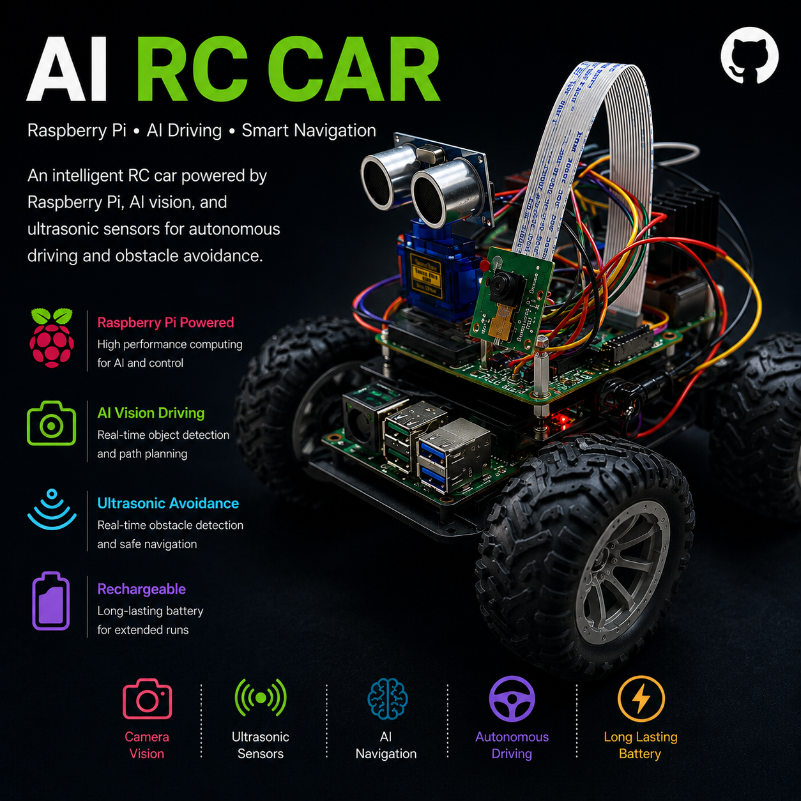

# Autonomous RC Car with Obstacle Avoidance



A sophisticated autonomous RC car built on Raspberry Pi, featuring real-time video streaming, obstacle detection, servo-controlled camera, and autonomous driving capabilities using image recognition and ultrasonic sensors.

## 📋 Project Overview

This project implements a fully-functional RC car capable of both manual control via joystick and autonomous navigation. The vehicle is equipped with advanced sensors for obstacle avoidance and a camera system for autonomous driving using image recognition.

### Key Features
- **Autonomous Driving**: Self-navigating with image recognition capabilities
- **Obstacle Avoidance**: HC-SR04 ultrasonic sensor mounted on a servo for 360° scanning
- **Live Video Streaming**: Real-time MJPEG camera feed over HTTP
- **Manual Control**: Gamepad/joystick support for remote operation
- **4-Motor System**: Independent control of front, back, left, and right DC motors
- **Servo-Mounted Camera**: Adjustable camera angle for better navigation awareness
- **Web Interface**: FastAPI-based control and monitoring dashboard

---

## 🛠️ Hardware Components

### Motors & Drivetrain
- **4x DC Motors** (Front, Back, Left, Right) - Standard brushed DC motors with PWM speed control
- **L298N Motor Driver** - Dual H-bridge motor driver for DC motor control
  - **Operating Voltage**: 5V-35V (typical: 12V)
  - **Motor A (Throttle)**: 
    - IN1: GPIO 17 (direction control)
    - IN2: GPIO 27 (direction control)
    - ENA: GPIO 18 (PWM speed control)
  - **Motor B (Steering)**:
    - IN3: GPIO 23 (direction control)
    - IN4: GPIO 24 (direction control)
    - ENB: GPIO 12 (PWM speed control)
  - **Power Supply**: Connected to +12V and GND (external power)

### Sensors
| Component | Type | GPIO Pins | Purpose |
|-----------|------|-----------|---------|
| **Ultrasonic Sensor (HC-SR04)** | Ultrasonic | TRIG: 5, ECHO: 6 | Obstacle detection & distance measurement |
| **Servo Motor** | PWM | GPIO 13 (50Hz) | Camera angle adjustment & sensor orientation |
| **IR Sensor** | Digital | GPIO 23 | Infrared obstacle detection |
| **Raspberry Pi Camera** | CSI/USB | - | Video capture & image recognition |

### Control
- **Joystick/Gamepad**: Pygame-based input for manual driving
- **Raspberry Pi**: Single-board computer running Python services

---

## 📁 Project Structure

```
pi/
├── auto/                      # Autonomous driving & joystick control
│   ├── auto.py               # Autonomous mode with motor control & sensors
│   └── joystick.py           # Manual control via gamepad/joystick
├── car/                       # Web server & REST API
│   ├── app.py                # FastAPI application for motor control
│   ├── index.html            # Web dashboard UI
│   └── run.txt               # Configuration/notes
├── camera/                    # Video streaming
│   └── stream.py             # MJPEG video stream server (Flask)
├── sensors/                   # Individual sensor modules
│   ├── motor.py              # Motor control utilities
│   ├── servo.py              # Servo control for camera angle adjustment
│   ├── sonic.py              # HC-SR04 ultrasonic sensor interface
│   └── ir.py                 # IR obstacle detection module
└── README.md                 # This file
```

---

## 🔌 GPIO Pin Configuration

### L298N Motor Driver Connections

**Motor A (Throttle Motor)**
```
IN1 (Direction):  GPIO 17  → L298N IN1
IN2 (Direction):  GPIO 27  → L298N IN2
ENA (PWM Speed):  GPIO 18  → L298N ENA (0-100% speed)
OUT1/OUT2:        → Motor M1 (Forward/Backward)
```

**Motor B (Steering Motor)**
```
IN3 (Direction):  GPIO 23  → L298N IN3
IN4 (Direction):  GPIO 24  → L298N IN4
ENB (PWM Speed):  GPIO 12  → L298N ENB (0-100% speed)
OUT3/OUT4:        → Motor M2 (Left/Right)
```

**Power Supply**
```
+12V:  External Power Supply → L298N +12V pin
GND:   External Power Supply → L298N GND, Raspberry Pi GND (common ground)
+5V:   Raspberry Pi 5V → L298N +5V (logic voltage)
```

### Motor Control Logic

| IN1 | IN2 | Motor Direction |
|-----|-----|-----------------|
| 1   | 0   | Forward         |
| 0   | 1   | Backward        |
| 0   | 0   | Stop            |
| 1   | 1   | Stop            |

Speed controlled via PWM on ENA/ENB (0-100%):
```
Servo Motor:      GPIO 13 (PWM @ 50Hz)
Ultrasonic TRIG:  GPIO 5
Ultrasonic ECHO:  GPIO 6
IR Sensor:        GPIO 23
```

---

## ⚙️ Installation & Setup

### Prerequisites
- Raspberry Pi (4B+ recommended for autonomous driving with ML)
- Python 3.7+
- Raspbian OS with GPIO access enabled
- Camera module enabled in raspi-config

### Install Dependencies

```bash
# Update system packages
sudo apt-get update
sudo apt-get upgrade

# Install required Python libraries
pip install fastapi uvicorn
pip install flask
pip install picamera2
pip install gpiozero
pip install pygame
pip install pillow

# Optional: For image recognition/autonomous driving
pip install opencv-python
pip install tensorflow  # or torch
pip install numpy
```

### Enable Camera & GPIO in raspi-config
```bash
sudo raspi-config
# Navigate to Interface Options → Enable Camera
# Ensure GPIO is enabled
```

### L298N Motor Driver Setup

**Important Wiring Notes:**
1. **Separate Power Supply**: Do NOT power the L298N from Raspberry Pi 5V! Use external 12V supply
2. **Common Ground**: Connect Raspberry Pi GND to L298N GND and external power supply GND
3. **Logic Supply**: Connect Raspberry Pi 5V to L298N +5V pin (for logic level only)
4. **Capacitors**: Add 100µF electrolytic capacitor across L298N power pins for stability
5. **Diodes**: Add 1N4007 diodes across motor terminals to protect against back-EMF

**Typical Wiring Diagram:**
```
Raspberry Pi GPIO (3.3V logic)
    ↓
L298N Input Pins (IN1-IN4)
    ↓
L298N H-Bridge
    ↓
DC Motors (M1, M2)
    ↓
External 12V Power Supply
```

---

## 🚀 Usage

### 1. **Manual Control (Joystick)**
```bash
cd /Users/macbookair/pi/auto
python joystick.py
```
- Connect a compatible gamepad/joystick
- Analogue sticks control throttle (forward/reverse) and steering (left/right)

### 2. **Autonomous Driving Mode**
```bash
cd /Users/macbookair/pi/auto
python auto.py
```
Features:
- Motor control with obstacle avoidance
- Servo-based distance scanning
- Automatic course correction based on ultrasonic readings
- Safe distance threshold: 30 cm

### 3. **Live Video Stream**
```bash
cd /Users/macbookair/pi/camera
python stream.py
```
- Access stream at: `http://<raspberry_pi_ip>:5000/video`
- Feed resolution: 640x480 MJPEG
- Used for image recognition & autonomous vision

### 4. **Web-Based Control**
```bash
cd /Users/macbookair/pi/car
uvicorn app:app --host 0.0.0.0 --port 8000
```
- Access dashboard at: `http://<raspberry_pi_ip>:8000`
- REST API for throttle & steering control
- Real-time PWM adjustment (-100 to 100)

### 5. **Individual Sensor Testing**

**Ultrasonic Distance Measurement:**
```bash
python sensors/sonic.py
```

**Servo Angle Control:**
```bash
python sensors/servo.py
```

**IR Obstacle Detection:**
```bash
python sensors/ir.py
```

---

## 📡 API Endpoints

### FastAPI Server (`car/app.py`)

**Set Motor Control**
```
POST /control
Body:
{
  "throttle": 50,    # -100 to 100 (forward/reverse)
  "steering": -30    # -100 to 100 (left/right)
}
```

**Get Video Feed**
```
GET /video
Returns: MJPEG stream
```

---

## 🧠 Autonomous Driving System

### Components
1. **Ultrasonic Sensor**: Continuously measures distance to obstacles
2. **Servo Motor**: Sweeps sensor across angles for full environment awareness
3. **Camera**: Captures video for image-based decision making
4. **Motor Control**: Executes navigation commands

### Obstacle Avoidance Logic
- **Safe Distance**: 30 cm
- **Sensor Sweep**: Servo scans angles for optimal path
- **Course Correction**: Auto-adjusts steering based on detected obstacles
- **Backup Logic**: Reverses and tries alternate routes when blocked

### Image Recognition (Planned Features)
- Lane detection for road following
- Traffic sign recognition
- Pedestrian detection
- Real-time object avoidance

---

## 🔧 Configuration & Tuning

### Motor Speed Adjustment
Edit `auto.py` or `joystick.py`:
```python
pwm = abs(speed) / 100  # Adjust scaling factor
throttle_pwm.value = pwm
```

### Servo Angle Range
Edit `servo.py`:
```python
duty = 2.5 + (angle / 18)  # Adjust for your servo (typically 1.0-2.0 to 2.0-3.0)
```

### Ultrasonic Safe Distance
Edit `auto.py`:
```python
SAFE_DISTANCE = 30  # Change to desired minimum distance (cm)
```

### Camera Resolution
Edit `camera/stream.py`:
```python
cam.configure(cam.create_video_configuration(main={"size": (1280, 960)}))
```

---

## 🐛 Troubleshooting

### L298N Motor Driver Issues

| Issue | Solution |
|-------|----------|
| Motors not responding at all | Check external 12V power supply; verify common ground connection between Pi and L298N |
| Motors move in opposite direction | Swap IN1/IN2 or IN3/IN4 connections for that motor |
| Motors run at max speed only | PWM may not be connected; check ENA/ENB pins to GPIO 18/12 |
| Inconsistent motor speed | Add 100µF capacitor across power pins; check for loose connections |
| L298N gets very hot | Verify correct power supply voltage; check for motor stall; ensure good ventilation |
| GPIO permission denied | Run with `sudo` or add user to GPIO group: `sudo usermod -aG gpio $USER` |

### General Issues

| Issue | Solution |
|-------|----------|
| Motors not responding | Check GPIO pins match your L298N wiring; verify power supply connected |
| Servo not moving | Confirm GPIO 13 is available; check PWM frequency (should be 50Hz) |
| Ultrasonic no readings | Check TRIG/ECHO pins (GPIO 5/6); verify timeout settings |
| Camera stream buffering | Reduce resolution or lower MJPEG quality; check network bandwidth |
| Joystick not detected | Run `python -m pygame.examples.gfxdraw` to test; check /dev/input/ permissions |

---

## 📚 Related Resources

- **L298N Datasheet**: https://www.st.com/resource/en/datasheet/l298.pdf
- **L298N Motor Driver Guide**: Complete specifications and application circuits
- **gpiozero Documentation**: https://gpiozero.readthedocs.io
- **Raspberry Pi GPIO**: https://www.raspberrypi.com/documentation/computers/gpio/
- **HC-SR04 Datasheet**: Ultrasonic distance sensor specifications
- **FastAPI Docs**: https://fastapi.tiangolo.com
- **OpenCV**: For advanced image recognition capabilities

---

## 🚧 Future Enhancements

- [ ] Machine Learning-based autonomous navigation
- [ ] SLAM (Simultaneous Localization and Mapping)
- [ ] Path planning algorithms (A*, Dijkstra)
- [ ] Multi-camera setup for stereo vision
- [ ] GPS integration for waypoint navigation
- [ ] Mobile app for remote control
- [ ] ROS (Robot Operating System) integration
- [ ] Cloud-based ML model inference
- [ ] Battery monitoring and low-power modes
- [ ] Obstacle mapping and memory

---

## 📄 License

This project is open-source and available for educational and hobbyist use.

---

## 👨‍💻 Author Notes

This RC car system demonstrates practical robotics concepts including:
- Real-time sensor fusion
- Motor control with feedback systems
- Network communication and streaming
- Autonomous navigation algorithms
- Human-machine interfaces (joystick + web)

Perfect for learning robotics, embedded systems, and Python programming on the Raspberry Pi!

---

**Last Updated**: June 2026  
**Raspberry Pi Model**: Tested on Pi 4B+  
**Python Version**: 3.7+
